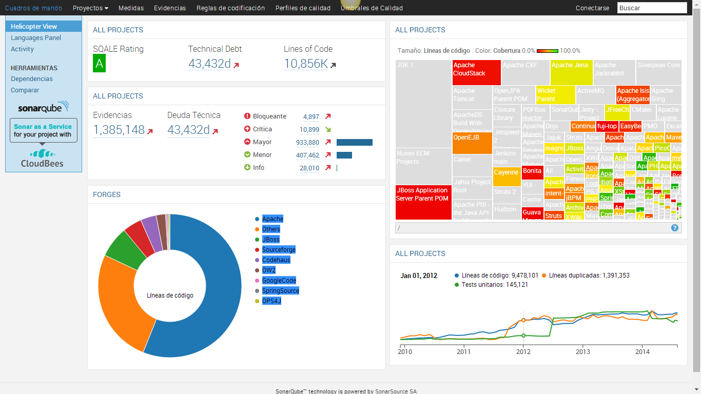

@title[What will you learn in 2018?]

## Ramp up your learning habits in 2018
<br>
#### The 2018 DevOps Porto Learning Challenge

<span class="byline lowernote">[ Miguel Alho, DevOpsPorto Meetup, December 12th 2017 ]</span>

---


<hr />
<span class="smallText">
    Software Engineer, Freelancer, Trainer <br/> 
    Designer, Photographer, Media Content Producer</span>
<hr />
@fa[twitter] @MytyMyky <br/>
@fa[globe] www.miguelalho.pt </br>
@fa[envelope] alho@miguelalho.com <br/>

---

# Lifelong Learning

Note:
What I want to talk about today is Lifelong Learning.
* Part of how we tap into our own "potential" - unrealized ability
* * initial steps require learning new skills, then practicing
* We need to have a growth mindset instead of a fixed mindset
* * the fact that you are here represents a growth mindset
* "get better" => continuous improvement (Kaizen)
* * personal kaizen

---

### As IT Pros, learning is 
## ESSENTIAL...

Note:
* We are, after all, knowledge workers, in a demanding profession. 
* Companies are and want to move fast , and that requires skilled professionals. 
* Problem solvers

* Being a highly skilled can bring along many advantages 
* * more enjoyable work, 
* * more fulfilling work, 
* * maybe more money as you progress.

* We need to avoid becoming obsolete

but there is a problem...
---

### ... it's also time consuming

Note:
* It's not hard; 
* It's actually enjoyable and a part of the "optimal experience" (Csikszentmihalyi -Flow); 
* But we are busy with everyday things and get lost in our ability to focus on aquiring new skills.

---

### The 5-Hour Rule

<span class="smallText">https://fityourself.club/the-5-hour-rule-to-excel-at-any-skill-55f2a635dc4b</span>

Note:
* Google it
* I haven't found science around this (mostly observation)
* * there is better science out there on learning and habit creation / behaviour change
* but it's believed that some are highly active in learning
* And its a great measurable thing to consider for ourselves
* deliberate learning
* READ - REFLECT - EXPERIMENT

(image credit: https://fityourself.club/the-5-hour-rule-to-excel-at-any-skill-55f2a635dc4b)

---


Note:
Finding time is hard, not learning itself:
* 8-12 hour work days, 
* comutes, 
* kids to care of, 
* a work-life balance to manage.

While we are managing all of this...
---

### ... Tech keeps changing right in front of us... 
# ALL THE TIME

Note:
So much is going on, and there is only so much we can get through. It is overwellming at least. Scary too. 

Guess what?!...

---?image=assets/memes/itsatrap.jpg

Note:
* We can't really learn everything and follow along in everything. 
* It's unfourtunate, => too much going on 
* we won't really get anywhere if we try to ingest everything at once (Think WIP).

AND THAT IS OK!

Avoid:
* cognitive overload, imposter syndrome, burnout

* needs to be acknowledged and accepted. 
* This doesn't mean we should stop learning. 
* we should be moving forward and evolving, continuously.

---
### Let's overcome this...

Note: 
* we know we want / need to learn to improve
* we know we have a time problem to overcome
* let's look at how we can get past that

And to do so, I'm going to present a "Challenge"...
---

<hr />
@fa[twitter] @DevOpsPorto #ImGoingToLearn 

Note:
* Get your twitter app ready and type in tha hash tag .

---
### Choose a topic - one is enough 

<span class="smallText">(hint: it's better than 0)</span>

Note:
It's like the Kanban WIP. Too much at the same time means nothing get's done.

---
### In 2018, 
### focus on learning that topic

Note:
* Focus your searches on that topic. 
* Read and ingest enough to know about it, 
* Prepare yourself to be able to apply it and bring it into you day-to-day work. 

* Topic doesn't have to be related to current work -> prepare yourself for what is to come
* discover new topics to move through and reduce the "unknown

---
### I'll Help with some topics

* DevOps Practices
* Application Quality Enhancements
* Code Patterns
* Tools
* Value Processes
* People Skills & Personal Development

Note:
* We'll break them down into areas, 
* You choose what you feel would be the most benficial to you short / mid / long term (choose one).
* If your feeling brave, choose more, but don't over do it. 
* Important to get at least one.

---

### DevOps Practices

* TDD / BDD
* CI / CD pipelines
* GIT
* Shell language
* Runbooks

Note:
Baseline stuff for devops - choose one of these if they are not a part of your toolbelt yet. They are foundational

---
### DevOps Practices

<div class="left">
    <ul>
        <li>Logging, Monitoring and business metrics capturing</li>
        <li>Infrastructure as code</li>
        <li>‎‎Feature flagging</li>
        <li>Deployment techniques</li>
        <li>DocOps</li>
    </ul>
</div>
<div class="right">
    <ul>
        <li>Security (OWASP and more)</li>
        <li>‎Portmortems</li>
        <li>Game Day activities</li>
        <li>Chaos engineering</li>
    </ul>
</div>

Note:
* alot is related to non-functional requirements and often "left behind"
* learn a web tech to be able to build a tolling portal
* mix feature flags and metrics capturing
* security -> have you salted?
* game day => deliberate practice

---

### Application Quality Enhancements

* ‎<span class="highlight">ADRs</span>
* Living documentation
* <span class="highlight">Consumer Driven Contracts</span>
* DB testing
* Infrastructure Testing
* Nonfunctional validation
 
---

<h3>ADRs <span class="smallText">(Architecture Decision Records)</span></h3>

```Markdown
#0003 - Add Request Logging
##Date: 2017-02-24

##Context
Debugging calls to the server can be hard if requests and responses are not logged. 
By logging every request and response we can understand if a request ever arrives 
at the service and we can also monitor requests by aggregating information from the 
requests and errors produced

##Decision
Add Middleware log every request and response. Response message should have 
code and time.

##Consequences
* we can see every resquest made and mount monitoring dashboards on 
top of that. Tracking and debuggung options are improved.
```
<span class="smallText">[https://github.com/joelparkerhenderson/architecture_decision_record](https://github.com/joelparkerhenderson/architecture_decision_record)</span>

Note:
* short text file (don't overdo it)
* single decision per file
* Easy to insert practice
* Helps describe changes in a repo / architecture
* Great help for the onboarding process
* Functional + Non Functional
* Context to your change history
* ThoughtWorks radar Adopt status

* Read Micheal Nygards stuff on this

---

### Consumer Driven Contracts

<div class="left">


</div>
<div class="right">

</div>
<span class="smallText">https://dius.com.au/2016/02/03/microservices-pact/</span>

NOTE:
* consumers write expectation
* services test valid 
* what about CDCs for 
    - what about at the shared db layer
    - non http services
* tools like Pact and Pacto help
* check out Beth Skurrie's presentations
---

### Coding Patterns

<div class="left">
    <ul>
        <li><span class="highlight">‎CQRS</li></li>
        <li>Resiliency patterns (circuit breaker)</li>
        <li>DB migrations</li>
        <li>NoSql</li>
        <li>Microservice patterns</li>
    </ul>
</div>
<div class="right">
    <ul>
        <li>Event Sourcing</li>
        <li>Message queue patterns</li>
        <li>Reactive design </li>
        <li>Scalability patterns</li>
    </ul>
</div>

Note: 
* uService ‎- discovery, monitoring, containerization, scheduling ...
* Resiliency - how to test at that layer
* how to test db integration layer´
* scalability at the service and infrastructure layers
---

<h3>CQRS </h3>
<span class="smallText">(Command Query Responsability Segregation)</span>

<span class="smallText">https://www.infoq.com/articles/cqrs_with_axon_framework</span>

Note:
* CQS at the architectural level
* Reads and writes through different channels
* single source of truth
* event propagation on state changes
* REACT a bit like this on the UI layer

---
### Tools

* <span class="highlight">Code Quality Analysis </span>
* <span class="highlight">Code change trend analysis</span>
* Linters
* ‎Build scripting
* Package managers
* Static analysis tools

---
#### Code Quality/Change Trend Analysis

<div class="left">

[codescene.io](https://codescene.io)
</div>
<div class="right">

[sonarqube.org](https://www.sonarqube.org)
</div>

Note:
* SonarQube stores code metrics and analysis histroically
* Code-maat checks for code coupling trends and change motivation
---
### Value Processes

* <span class="highlight">Event storming</span> 
* Value stream mapping
* Impact mapping
* Maturity model evaluations

---
### Event Storming

<div class="left eventstorming">

</div>

<div class="right">
<ul>
    <li>Physical software modeling technique</li>
    <li>Excelent for project inception phases</li>
    <li>Domain events and Aggregate exploration</li>
    <li>Helps find Bounded contexts and subdomains, too</li>
</ul>
</div>

Note:
* Sticky note based
* Low tech, low cost techinique
* everyone participates
* Maps beautifully to DDD concepts
* Check out Alberto Brandolini's work on this
* even when done poorly, It still brings in a lot of value

---

### People Skills & Personal Development

* Writing
* "‎Captains Log"
* Empathy 
* Management & Leadership Skills
* Team & Communication Skills
* Learning Organizations
 
---

### You can choose topics that are not on this list

---

### Commit to it throughout the year

Note:
...but it's OK to change throughout the year
(that's ok)

---

## Sounds easy right?

Note:
I hear too often "I don't have the time"
(I sometimes say it too)
Back to the idea of making time!

---


---

### Some techniques:

* Lunch and Learn
* Group gatherings
* Book Reading Habit
* Mix activities
* Mix it into work
* YOU time (schedule it!)

NOTE: 
(mix and match)
If you know any good ones that work for you , PLEASE DO SHARE 

---

### Lunch and Learn
<span class="smallText"> ~ 40 hours per year of learning if you do it once a week.<span>


<span class="smallText">(1/5th of the 5-Hour rule)</span>

Note:
* Classic : Someone brings a theme and a short presentations, and presents at lunch hour.
all you need is some projector. everyone typically needs to eat lunch
* Variation 1: 
Just watch a tutorial or conference presentation at lunch (in group)
0 cost, guaranteed info ingestion
* Variation 2
While having lunch, watch some tutorial or presentation

---
### Group Gatherings

Note:
* Go To Conferences, Workshops and Meetups
* Our meetup is 2 hours of monthly-ish learning.
* Social aspect enables some interesting things in our brains
* take it a step further and organize one

--- 

### Habit of reading books

Note:
Challenge Adendum : Book challenge
* at least one tech book per year / semester / quarter
* fiction plus non fiction
* ‎book group / swap
* start a company library
* free books and cheap used books

---

### Mix Activities 

* read books on your comute
* listen to podcasts while you drive
* listen to audio books while you excercise
* watch a presentation while you cook
* toilet reading

Note: 
The idea is to do regular daily stuff (not cognitively expensive) with information ingestion

* Learning requires focus. You can't focus if you mix activities that require attention. 
* Multitasking is expensive
* Consider only activities that do not require great attention
* consider mixing senses (amygdala is connected to the hippocampus)

---

### Mix it into work

* katas
* tutorials
* Q&A
* documenting and sharing learnings
* link sharing

Note:
On the job, deliberately

---

### Pairing at work

Learn what other do by working with them, or help them acheive their goals

Note:
* a dev can work with ops on on-call duty
* a dev can automate some unautomated process
* a dev can do customer support

Volunteer for it

---

### Improving at work

* Using 1-on-1s and mentoring
* Logging work and discoveries
* Learning retrospectives
* Portmortems to blamelessly learn from failure
* 20% time projects or hack-a-thons

---

### YOU time

Ultimately, YOU (may) need to schedule time for learning

Note:
deliberately set the time aside (like a meeting) 

---
 
### Bring others along for the ride

Note:
Like running, learning efforts can benefit from having others around you, pushing you forward and feeding from your effort.
Careful, others may reduce efficiency if not focused / committed.

---

### Bring your organization along

Note:
Is your company a learing organization? Can you be the one who helps transform it into one?
* concept of learning org is more then this, obviously, but it's a step in that direction

---

### The company you work for IS accountable for your training

Note:
Both by law and by interest.

Lobby for your training if you are not getting it.
* get to go to workshops and conferences
* get them to buy the books
* get them to subsscribe to training sites (Lynda, Pluralsight, Mapt, Safari, Udemy...)

---

### YOU are accountable for your training

Note:
* You SHOULD buy books and videos
* You SHOULD go to confrences and workshops
* You should be able to afford these things... If not, something is fundamentally wrong. 

---

## You OWN your career. 

Note:
It solely up to you
 The company you work for may help, your colleagues and friends may help, but it is up to you...
---

## In 2018, go learn something new!

<hr />
<span class="smallText"> thank you very much!</span>
<hr />
@fa[twitter] @MytyMyky <br/>
@fa[globe] www.miguelalho.pt </br>
@fa[envelope] alho@miguelalho.com <br/>
---
